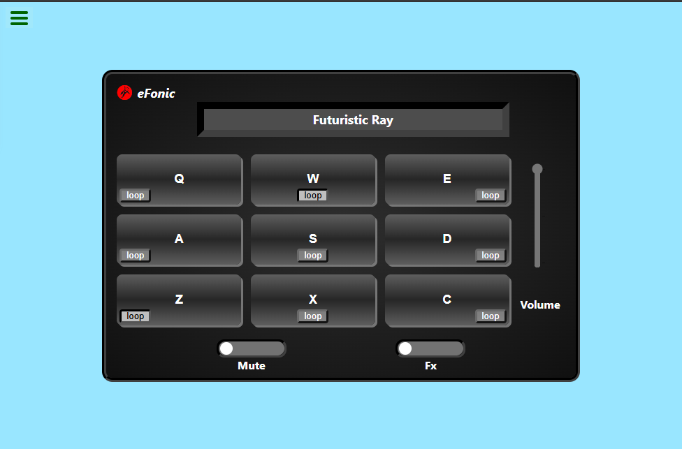

# efonic: React Drum Machine 🎵

efonic is an online sound effect drum machine that lets you create and enjoy rhythmic beats. This project was built as part of the freeCodeCamp Drum Machine challenge and includes several features for an enhanced user experience.

---

## 🌟 Features

- **Audio Selection**: Choose from a variety of sound effects.
- **Audio Looping**: Play sounds on a loop to create rhythm patterns.
- **Volume Control**: Adjust playback volume to your liking.
- **Playback Title Display**: See the name of the currently playing sound.
- **Sound Effect Switching**: Switch between different sound banks for variety.

---

## 🔧 Technologies Used

- **React**: For the frontend framework.
- **HTML & CSS**: For structuring and styling the app.

---

## 📱 Responsiveness

This project was designed to be mobile-friendly and works seamlessly across various devices.  
*(Add specific tools/techniques used for responsiveness, such as CSS Grid, Flexbox, or media queries.)*

---

## 🥁 What Does This Project Do?

efonic allows users to interact with a drum machine interface to create beats using various sound effects. Users can loop audio tracks, switch between sound banks, control volume, and enjoy real-time playback title updates. This is the completed coding for [freeCodeCamp](https://www.freecodecamp.org) [Drum Machine](https://www.freecodecamp.org/learn/front-end-libraries/front-end-libraries-projects/build-a-drum-machine) project.

---

## 🚀 Getting Started

To get the project running locally:

1. Clone this repository:  
   ```bash
   git clone https://github.com/nhope123/drums.git
2. Navigate to the project directory:
   ```bash
   cd efonic
3. Install dependencies:
   ```bash
   npm install
4. Start the development server:
   ```bash
   npm start

The app will be available at http://localhost:3000.

## 📸 Screenshot
<div align='center' >
  
</div>

## 🌍 Live Demo
[Drum](https://nhope123.github.io/drums/)
## 📜 License
This project is licensed under the MIT License. See the [LICENSE](LICENSE.md) file for details.


